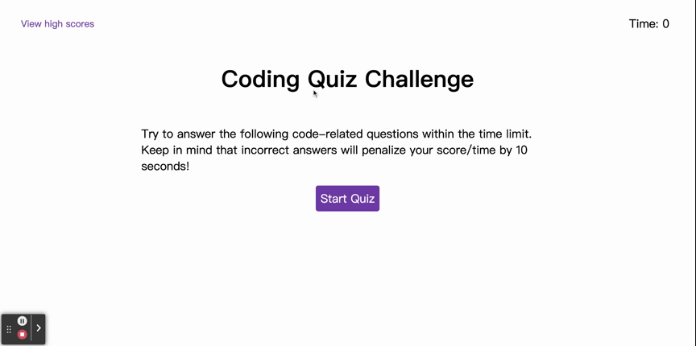

# code-quiz

## Description

This project is a code quiz. 

It has 5 questions in total. There's a time limitation of 75 seconds. Each wrong answer will penalize the score/time by 10 seconds.

View the deployed website: https://ruxinqu.github.io/code-quiz/

## Usage

* When a user clicks on the 'Start Quiz' button, a quiz page will be shown. 
* A message of 'Correct' or 'Wrong' will show up when a choice is clicked.
* Each question can only be answered **ONCE**.
* When the questions have all been answered, or the time has run out, the user will see the score and enter the initials to save their score.
* High score records can be accessed before starting the quiz, while taking the quiz and after submiting the initials.
* The high score records are sorted from high to low.
* The 'clear high score' button will remove all the local high score records.
* The 'go back' button will relocate the window to start quiz page.
* The animation below shows the web application's appearance and functionality:

## Sources Referenced
Google || Youtube 

